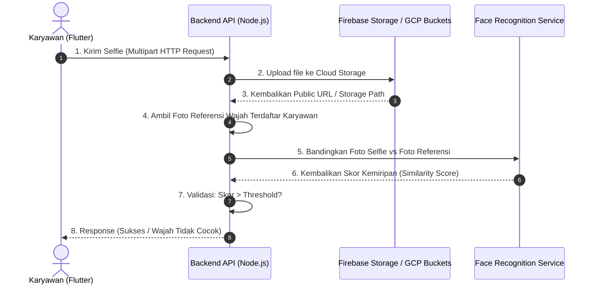

# Rencana Implementasi: Face Verification per Akun

Dokumen ini berisi analisis, arsitektur, dan perbandingan solusi untuk mengimplementasikan verifikasi wajah (Face Recognition) yang spesifik untuk masing-masing akun karyawan.

---

## 1. Analisis Kondisi Saat Ini (Current State)

* **Presensi Kamera**: Flutter saat ini menggunakan package `google_mlkit_face_detection` untuk mendeteksi keberadaan wajah (*face detection*) dan keaktifan pengguna (*liveness check* melalui kedipan mata dan senyum).
* **Pengiriman Selfie**: Setelah foto diambil, Flutter mengirimkan data JSON ke endpoint `/api/attendance/check-in` dengan property `'selfie_url': image.path` (yang merupakan path file lokal di dalam memori HP, misalnya `/data/user/0/.../cache/CAP_xyz.jpg`).
* **Penyimpanan Log**: Backend Node.js menerima string `selfie_url` tersebut dan menyimpannya mentah-mentah ke Firestore tanpa melakukan upload file gambar asli. Akibatnya, gambar selfie tidak dapat dilihat dari luar perangkat HP tersebut.

---

## 2. Perubahan Arsitektur Utama yang Dibutuhkan

Sebelum memilih metode pencocokan wajah, kita wajib mengimplementasikan **mekanisme upload file gambar** dari aplikasi mobile ke cloud/backend.



### A. Perubahan Database (PostgreSQL / Firestore)
Kita membutuhkan field baru untuk menyimpan **Foto Referensi Wajah** yang sah milik masing-masing user.
1. **PostgreSQL Table `users`**:
   * Tambahkan kolom `face_url` (VARCHAR) untuk menyimpan URL foto referensi wajah karyawan yang diunggah oleh HRD.
2. **Firestore Collection `selfie_logs`**:
   * Field `selfie_url` yang tadinya berupa path lokal HP akan diubah menjadi URL Firebase Storage yang valid/publik.

### B. Perubahan Backend (Express.js)
* Menambahkan middleware `multer` di Express.js untuk menerima file upload (`multipart/form-data`) pada endpoint `/api/attendance/check-in` dan `/api/attendance/check-out`.
* Menambahkan fungsi upload gambar ke **Firebase Storage** (karena library Firebase Admin sudah terinstal di backend).

---

## 3. Opsi Metode Face Recognition (Pencocokan Wajah)

Berikut perbandingan teknis 3 opsi utama untuk mencocokkan wajah selfie dengan foto referensi:

| Parameter | Opsi A: Azure Face API (Cloud API) | Opsi B: Node.js `face-api.js` (Lokal Server) | Opsi C: Python Microservice (Flask/FastAPI) |
| :--- | :--- | :--- | :--- |
| **Biaya** | Gratis (Free tier 30k request/bulan) | 100% Gratis | 100% Gratis |
| **Lokasi Komputasi** | Server Microsoft Azure | Di dalam GCP Cloud Run kamu | GCP Cloud Run kedua (Service Terpisah) |
| **Kemudahan Koding** | **Sangat Mudah** (Hanya panggil endpoint POST) | **Sedang** (Perlu memuat model AI di Node.js) | **Mudah** (Menggunakan library Python `face_recognition`) |
| **Kompatibilitas Docker**| Sangat aman (tidak ada dependency OS) | Rawan crash jika package OS C++ tidak sesuai | Sangat aman (menggunakan Docker image Python) |
| **Akurasi** | Sangat Tinggi (Skala Enterprise) | Sedang - Tinggi (Tergantung model TensorFlow) | Tinggi (Menggunakan model dlib) |
| **Kecepatan Response** | Cepat (bergantung internet) | Cepat (lokal CPU server) | Cepat (lokal internal network) |

---

## 4. Detail Implementasi per Opsi

### Opsi A: Azure Face API (Rekomendasi Utama)

Opsi ini memanfaatkan API kognitif Azure untuk melakukan verifikasi 1:1 antara foto selfie dan foto referensi karyawan.

```javascript
// Contoh Logika Backend (Express.js)
const axios = require('axios');

async function verifyFace(registeredFaceUrl, capturedFaceUrl) {
  const endpoint = process.env.AZURE_FACE_ENDPOINT + '/face/v1.0/verify';
  const headers = {
    'Ocp-Apim-Subscription-Key': process.env.AZURE_FACE_KEY,
    'Content-Type': 'application/json'
  };
  
  // Catatan: Azure membutuhkan deteksi Face ID terlebih dahulu
  // atau bisa membandingkan langsung menggunakan URL gambar
  const body = {
    faceId1: await getFaceId(registeredFaceUrl),
    faceId2: await getFaceId(capturedFaceUrl)
  };

  const response = await axios.post(endpoint, body, { headers });
  return response.data; // Mengembalikan { isIdentical: true, confidence: 0.9 }
}
```

> [!TIP]
> **Mengapa ini cocok untuk TCC?**
> Menghubungkan multi-cloud (GCP untuk Server & DB, Firebase untuk NoSQL & Storage, Azure untuk AI) adalah arsitektur modern yang menunjukkan pemahaman integrasi sistem cloud yang kuat.

---

### Opsi B: Node.js `face-api.js` (Pure JS di Server Express)

Menjalankan model TensorFlow.js langsung di server backend Express.js tanpa server tambahan.

* **Package**: `@vladmandic/face-api` (versi yang dioptimalkan untuk Node.js tanpa bindings C++ yang merepotkan).
* **Model**: Model `face_landmark_68`, `face_recognition`, dan `ssd_mobilenetv1` ditaruh di folder `/public/models`.
* **Proses**:
  1. Load model saat server menyala.
  2. Baca gambar dari Firebase Storage ke Buffer.
  3. Hitung deskriptor wajah (`computeFaceDescriptor`) untuk kedua gambar.
  4. Hitung jarak Euclidean. Jika jarak `< 0.6`, wajah dinyatakan sama.

---

### Opsi C: Python Microservice di GCP Cloud Run

Membuat service terpisah di GCP menggunakan Python. Service ini hanya menerima dua URL gambar, lalu mengembalikan status kecocokan.

```python
# Contoh Kode Flask Python
import face_recognition
from flask import Flask, request, jsonify

app = Flask(__name__)

@app.route('/verify', methods=['POST'])
def verify():
    data = request.json
    img1_url = data['img1']
    img2_url = data['img2']
    
    # Download gambar & load ke face_recognition
    image1 = load_image_from_url(img1_url)
    image2 = load_image_from_url(img2_url)
    
    encoding1 = face_recognition.face_encodings(image1)[0]
    encoding2 = face_recognition.face_encodings(image2)[0]
    
    results = face_recognition.compare_faces([encoding1], encoding2)
    distance = face_recognition.face_distance([encoding1], encoding2)[0]
    
    return jsonify({
        "matched": bool(results[0]),
        "distance": float(distance)
    })
```

---

## 5. Rencana Langkah Kerja Garapan (Work Checklist)

Setelah kamu selesai melakukan *brainstorming* fitur lain, kita bisa menggarap fitur ini dengan langkah-langkah berikut:

1. **Database Update**:
   - Menambahkan kolom `face_url` ke tabel `users` di PostgreSQL.
   - Membuat endpoint `PUT /api/users/:id/face` di backend untuk pendaftaran foto referensi wajah karyawan (oleh HRD).
2. **Flutter Multipart Upload**:
   - Mengubah service API check-in di Flutter agar mengirim data foto dalam format `MultipartRequest` (mengunggah file fisik `.jpg` hasil jepretan kamera).
3. **Backend Upload & Storage Integrator**:
   - Menambahkan middleware upload file di backend-api.
   - Mengunggah file tersebut ke Firebase Storage untuk mendapatkan HTTPS URL publik.
4. **Verifikator Wajah**:
   - Mengintegrasikan salah satu opsi di atas (Azure/Face-api/Python) ke dalam controller `checkIn` dan `checkOut`.
   - Menolak absensi jika hasil verifikasi wajah menyatakan tidak cocok (skor kemiripan rendah).
