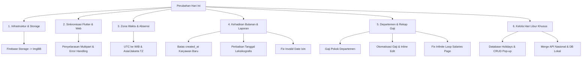

# Rekapitulasi Perubahan & Perbaikan Sistem Absensi & Gaji (Hari Ini)

Dokumen ini berisi rekap lengkap semua perubahan, perbaikan bug, dan penambahan fitur baru yang telah dilakukan pada sistem backend (Node.js), frontend web (Next.js), dan aplikasi mobile (Flutter).

---

## 🌟 Ringkasan Perubahan Utama

---

## 🛠️ Detail Perbaikan & Pengembangan

### 1. Migrasi Firebase Storage ke ImgBB
* **Masalah:** Firebase Storage mengalami kendala autentikasi/akses berbayar atau pembatasan kuota yang menyulitkan pengunggahan gambar selfie absensi.
* **Solusi:** Migrasi penyimpanan gambar ke **ImgBB** (gratis). Mengubah helper pengunggahan gambar di backend agar menggunakan REST API ImgBB secara aman dan mengembalikan URL publik untuk diproses oleh Azure Face API.
* **File Terkait:**
  * [backend-api/utils/storageHelper.js](file:///d:/IF23/SMT%206/Prak%20TCC/TA_TCC/backend-api/utils/storageHelper.js)

### 2. Sinkronisasi & Perbaikan Pendaftaran Wajah (Flutter & Web)
* **Masalah:** Terjadi kegagalan pendaftaran wajah karena ketidaksesuaian nama field multipart (`face_image` vs `face`) dan pesan error dari backend tidak tertangkap secara informatif di frontend.
* **Solusi:**
  * Menyelaraskan field pengunggahan gambar di Flutter [attendance_service.dart](file:///d:/IF23/SMT%206/Prak%20TCC/TA_TCC/mobile_karyawan/lib/ui/controllers/attendance_provider.dart) dan Web HRD agar sesuai dengan spesifikasi backend.
  * Menambahkan penanganan error di Web HRD untuk menampilkan pesan kesalahan yang sebenarnya dikirim dari server saat pendaftaran wajah gagal.
* **File Terkait:**
  * [web-hrd/app/dashboard/users/page.jsx](file:///d:/IF23/SMT%206/Prak%20TCC/TA_TCC/web-hrd/app/dashboard/users/page.jsx)
  * [mobile_karyawan/lib/ui/controllers/attendance_provider.dart](file:///d:/IF23/SMT%206/Prak%20TCC/TA_TCC/mobile_karyawan/lib/ui/controllers/attendance_provider.dart)

### 3. Zona Waktu Absensi & Keterlambatan (WIB / Asia/Jakarta)
* **Masalah:** Waktu absensi tersimpan menggunakan zona UTC di database GCP, menyebabkan perhitungan status terlambat tidak akurat dan perbandingan jam meleset.
* **Solusi:**
  * Mengonversi timestamp check-in dari UTC ke waktu Jakarta (WIB) secara eksplisit sebelum disimpan ke database.
  * Menyesuaikan logika kalkulasi keterlambatan absensi agar mengacu ke zona waktu `Asia/Jakarta`.
* **File Terkait:**
  * [backend-api/controllers/attendanceController.js](file:///d:/IF23/SMT%206/Prak%20TCC/TA_TCC/backend-api/controllers/attendanceController.js)

### 4. Laporan Kehadiran Bulanan & Penanganan Batas Akun
* **Batas Pembuatan Akun (`created_at`):** Karyawan baru tidak lagi ditandai sebagai `ALPHA` atau `LIBUR` pada tanggal sebelum akun mereka dibuat. Tanggal tersebut kini berstatus `—` (tidak aktif) dan tidak dihitung ke dalam jumlah hari kerja bulanan.
* **Perbaikan Tanggal Leksikografis:** Mengubah perbandingan tanggal yang sebelumnya bermasalah dengan waktu UTC di kontainer GCP menjadi perbandingan string tanggal lokal (`YYYY-MM-DD`) secara leksikografis agar penentuan hari absen yang sudah lewat berjalan akurat.
* **Bug `Invalid Date` Pengajuan Izin:** Memperbaiki crash/bug `Invalid Date` yang disebabkan oleh bentrok objek Date PostgreSQL di Node.js saat digabungkan dengan string waktu. Tanggal izin sekarang dikonversi ke string ISO `YYYY-MM-DD` terlebih dahulu sebelum diproses.
* **File Terkait:**
  * [backend-api/controllers/attendanceController.js](file:///d:/IF23/SMT%206/Prak%20TCC/TA_TCC/backend-api/controllers/attendanceController.js)

### 5. Gaji Pokok Departemen & Otomatisasi Rekap Gaji
* **Gaji Pokok per Departemen:** Menambahkan kolom `basic_salary` di tabel `departments`. HRD kini dapat menentukan/mengedit Gaji Pokok Standar untuk masing-masing departemen secara langsung melalui antarmuka web.
* **Redesain Halaman Rekap Gaji:**
  * HRD tidak perlu lagi menginput data karyawan satu per satu. Sistem akan memuat seluruh nama karyawan secara otomatis berdasarkan filter Bulan, Tahun, dan Departemen (atau Semua Departemen).
  * Menampilkan ringkasan kehadiran (`Hadir`, `Terlambat`, `Alpha`, `Izin`) secara real-time pada tabel rekap gaji.
  * Menyediakan kolom input inline untuk **Tunjangan** dan **Potongan** yang secara dinamis menghitung **Total Bersih** di frontend (`Gaji Pokok + Tunjangan - Potongan`).
  * Menyediakan tombol **Simpan** per baris karyawan yang menjalankan aksi *upsert* ke database (insert data baru atau update data lama).
* **Fix Infinite Loop:** Mengatasi loading stuck pada halaman gaji dengan menghapus instansial `showToast` dari dependensi `useCallback`.
* **File Terkait:**
  * [backend-api/db.js](file:///d:/IF23/SMT%206/Prak%20TCC/TA_TCC/backend-api/db.js)
  * [backend-api/controllers/departmentController.js](file:///d:/IF23/SMT%206/Prak%20TCC/TA_TCC/backend-api/controllers/departmentController.js)
  * [backend-api/controllers/salaryController.js](file:///d:/IF23/SMT%206/Prak%20TCC/TA_TCC/backend-api/controllers/salaryController.js)
  * [web-hrd/app/dashboard/departments/page.jsx](file:///d:/IF23/SMT%206/Prak%20TCC/TA_TCC/web-hrd/app/dashboard/departments/page.jsx)
  * [web-hrd/app/dashboard/salaries/page.jsx](file:///d:/IF23/SMT%206/Prak%20TCC/TA_TCC/web-hrd/app/dashboard/salaries/page.jsx)

### 6. Kelola Hari Libur Khusus oleh HRD
* **Penyimpanan Lokal:** Membuat tabel database `holidays` secara otomatis untuk menampung hari libur khusus yang ditambahkan manual oleh HRD.
* **Integrasi Logika Kehadiran:** Logika backend secara dinamis menggabungkan hari libur dari API publik Indonesia dengan hari libur lokal yang diinput oleh HRD di database.
* **Antarmuka Pengaturan HRD:** Menambahkan tabel "Hari Libur Khusus" di tab **Pengaturan > Aturan Kehadiran** lengkap dengan pop-up dialog modal untuk operasi CRUD (Tambah, Edit, Hapus) hari libur beserta keterangannya.
* **File Terkait:**
  * [backend-api/utils/holidayHelper.js](file:///d:/IF23/SMT%206/Prak%20TCC/TA_TCC/backend-api/utils/holidayHelper.js)
  * [backend-api/controllers/holidayController.js](file:///d:/IF23/SMT%206/Prak%20TCC/TA_TCC/backend-api/controllers/holidayController.js)
  * [backend-api/routes/holidayRoutes.js](file:///d:/IF23/SMT%206/Prak%20TCC/TA_TCC/backend-api/routes/holidayRoutes.js)
  * [web-hrd/app/dashboard/settings/page.jsx](file:///d:/IF23/SMT%206/Prak%20TCC/TA_TCC/web-hrd/app/dashboard/settings/page.jsx)

---

## 📈 Status Implementasi & Pengujian

Semua perubahan telah diimplementasikan, diverifikasi secara lokal, dan dicocokkan kinerjanya. Berkas-berkas perubahan telah di-commit dan didorong (push) ke repositori git utama (`origin/main`), yang memicu otomatisasi build di GCP agar perubahan segera aktif pada lingkungan produksi.
